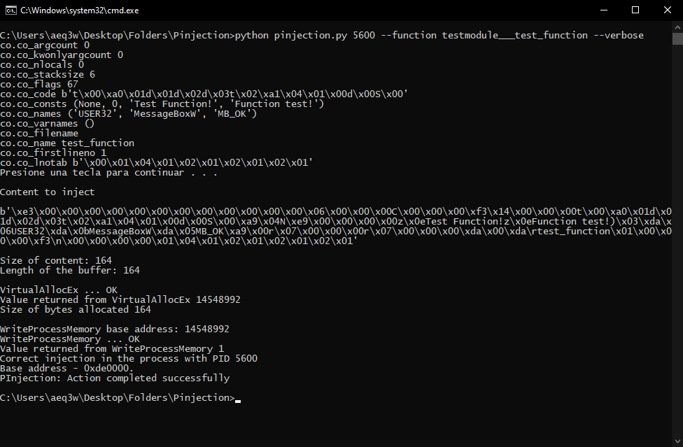
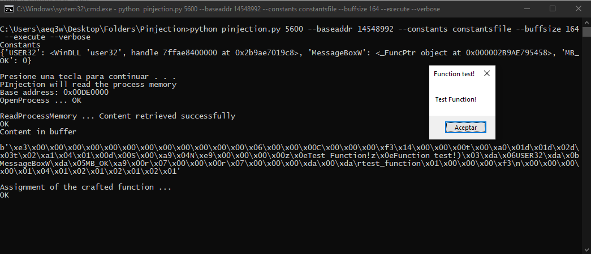

# <h1 align=center> PInjector</h1>

# [Readme-ES](README.md) - [Readme-EN](README-EN.md)
## What is it?

PInjection is a Python script that can be used as a Module or as an executable script from the command line (CLI script). What this script does is inject Object Code into a specific memory region of a process using the Windows API ([OpenProcess](https://docs.microsoft.com/en-us/windows/win32/api/processthreadsapi/nf-processthreadsapi-openprocess), [VirtuallAllocEx](https://docs.microsoft.com/en-us/windows/win32/api/memoryapi/nf-memoryapi-virtualallocex), [WriteProcessMemory](https://docs.microsoft.com/en-us/windows/win32/api/memoryapi/nf-memoryapi-writeprocessmemory) and [ReadProcessMemory](https://docs.microsoft.com/en-us/windows/win32/api/memoryapi/nf-memoryapi-readprocessmemory).

## What is NOT!

  - PInjection **IT IS NOT** an executable script to get your virus to run and break your friend's computer when they go to the bathroom.
  - PInjection **IT IS NOT** an executable script to save executable functions or machine code to a specific memory region.

## What YES it is!

  - PInjection **IS** an executable script for specific Object Code meter and "marshalized" in a specific memory region.
  - PInjection **IS** a module that provides an easy-to-use interface for any newbie to Python.
  - PInjection **IS** una buena elección para ofuscar y ocultar código objeto en un proceso (Similar a DLL Injection).
  - PInjection **IS** un software libre y gratuito. (GNU GPLv3).

## Limitations.

As I said, this is not a script to execute and you will automatically destroy the target computer permanently,
but a script / module to load object code in the memory of a process, this means explicitly what I say. To execute the object code that is saved,
you have to know what it is, since then you will have to pass a FunctionType using the library types, and there you will have to define all the constants used
in the object code. The loading of the object code is automatic, the execution **is NOT**. There are also many processes in which you will not be able to inject,
since these processes have and / or present specific internal conditions that do not allow access to their memory regions

### Examples.
***
Injecting the test_function function from the testmodule file into the explorer.exe process (explorer.exe PID 5600).  
Command:  `python pinjection.py 5600 --function testmodule___test_function --verbose Injecting bytecode into explorer.exe`

Executing the function once inyected (It is in the memory, at the base address 14548992)
Command: `python pinjection.py 5600 --constants constantsfile --baseaddr 14548992 --buffsize 164 --execute --verbose Executing bytecode from explorer.exe memory`  

### 0.7 notes
 - First binary release, this one should be used in a CLI environment, and the python file as a package or module.

#### DISCLAIMER, NOTICES AND LEGAL NOTICES.
  - If memory is not deallocated in the specific process, a [memory leak](https://en.wikipedia.org/wiki/Memory_leak) will be generated.
  - All multimedia contents are licensed under the Creative Commons BY-SA license.
  - This software was designed for educational purposes. The author disclaims all responsibility for the use made of it.
