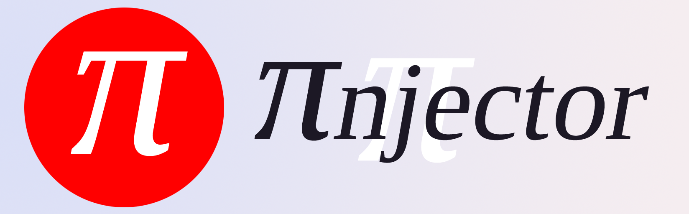

<h1 align=center> PInjector</h1>

## ¿Qué es?
PInjection es un script de Python que puede funcionar como Módulo o como script ejecutable desde la línea de comandos (CLI script). Este script lo que hace es inyectar Código Objeto en una región de memoria específica de un proceso utilizando la API de Windows ([OpenProcess][1], [VirtuallAllocEx][2], [WriteProcessMemory][3] y [ReadProcessMemory][4]).

## ¿Qué NO es?
-----------------
 - PInjection **NO** es un script ejecutable para meter tu virus ejecutarlo y romperle la computadora a tu amigo.
 - PInjection **NO** es un script ejecutable para guardar funciones en una región de memoria específica.
 
### ¡Que SÍ es!
-----------------
 - PInjection **SI** es un script ejecutable para meter Código Objeto específico en una región de memoria específica.
 - PInjection **SI** es un módulo que provee una interfaz sencilla de utilizar para cualquier novato en Python.
 - PInjection **SI** es un software libre y gratuito. *(GNU GPLv3)*
 
 
#### Notas 0.2

 - Borrado Shell, test_function y test_injection.
 - Modificado para ser utilizado como un script o desde la línea de comandos.
 - Probado en Python 3.7.9 utilizando Windows 10 Home.
 - Actualmente solo puede alojar memoria e imprimir (o asignar a una variable) la dirección base de memoria alojada, **NO ES RECOMENDABLE** ejecutar este script muchas veces, ya que este script genera [memory leaks](https://en.wikipedia.org/wiki/Memory_leak).

#### DISCLAIMER Y AVISOS LEGALES.
 - Todos los contenidos multimedia estan licenciados bajo la licencia [Creative Commons BY-SA](https://creativecommons.org/licenses/by-sa/3.0/deed.es)
 - Todos mal uso que se le de a este software, queda estricta y absolutamente absuelto de *mea culpa* y/o responsabilidad sobre los daños y perjuicios generados a través del uso de este software, al utilizar este software estas accediendo a tomar cualquier tipo de responsabilidad sobre lo que el software pueda generar al ser utilizado.
[1]: https://docs.microsoft.com/en-us/windows/win32/api/processthreadsapi/nf-processthreadsapi-openprocess
[2]: https://docs.microsoft.com/en-us/windows/win32/api/memoryapi/nf-memoryapi-virtualallocex
[3]: https://docs.microsoft.com/en-us/windows/win32/api/memoryapi/nf-memoryapi-writeprocessmemory
[4]: https://docs.microsoft.com/en-us/windows/win32/api/memoryapi/nf-memoryapi-readprocessmemory
